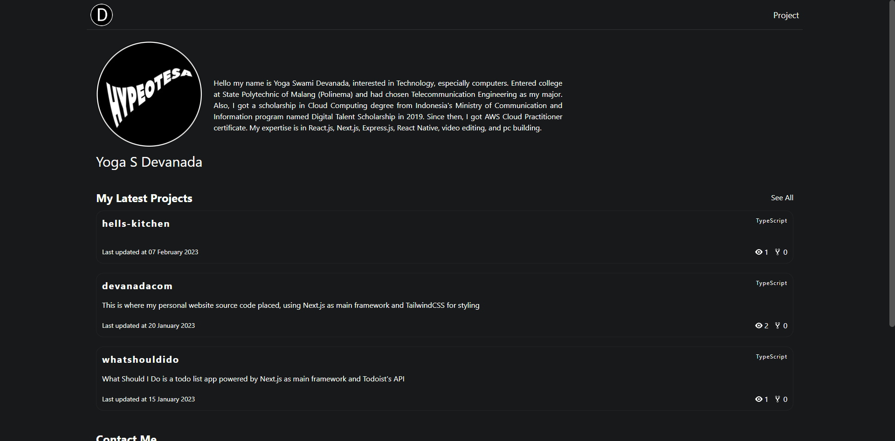
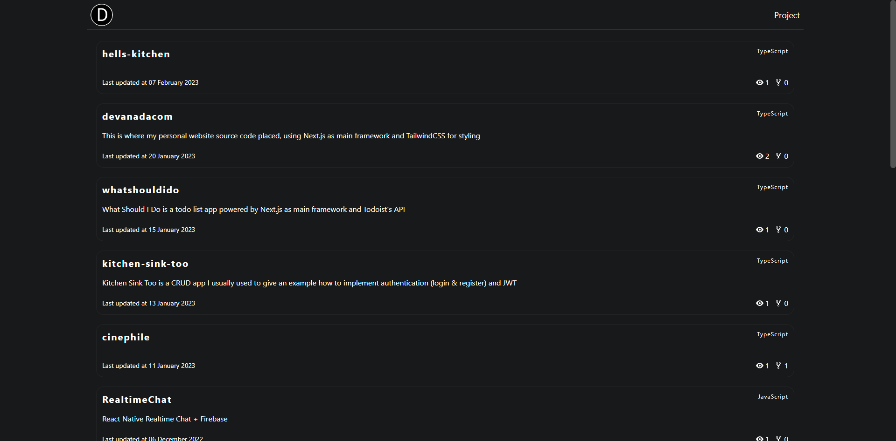

# devanada.com

This project is a personal website for Devanada. It is a static site built with Next.js and TailwindCSS. It is deployed on Vercel. The website is a single page application that uses the GitHub API to get pinned repositories and profile information.

## Documentation

[Deployment](https://devanada.com/)

## Features

- Get pinned repositories using GitHub API
- Get profile information using GitHub API

## Tech Stack

**Client:** Next.js, Axios, TailwindCSS, Moment.js, React-Icons

## Run Locally

Clone the project

```bash
  git clone https://github.com/devanada/devanadacom.git
```

Go to the project directory

```bash
  cd devanadacom
```

Install dependencies

```bash
  npm install
```

Start the server

```bash
  npm run dev
```

## Screenshots




